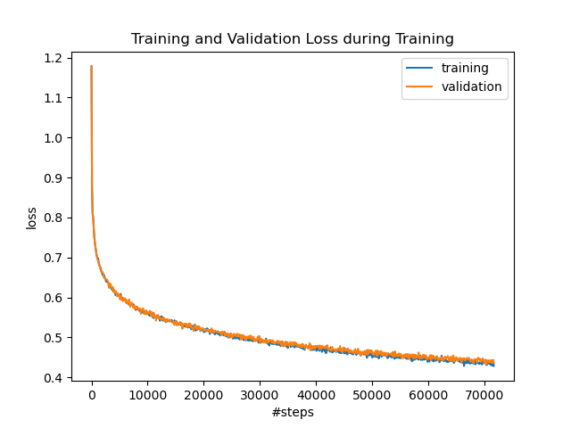

# LLM

This is a transformer jupyter notebook. 

I trained my own transformer model on an NVidia A100 40GB using the C4 dataset (https://huggingface.co/datasets/allenai/c4/tree/main/en).



## Installation
It is recommended to first create a virtual environment and in this environment install the dependencies with
```sh
pip install -r requirements.txt
```

## Usage
Here is an example sentence using the pretrained model. The following prompt
```sh
What is the difference
```
was completed to
```sh
[(' between', '97.99%'), (' of', '0.52%'), (' in', '0.34%'), (' to', '0.23%'), ('?', '0.14%'), ('?\n', '0.08%'), (' with', '0.07%'), (' for', '0.07%'), (' from', '0.06%'), (' that', '0.05%')]
What is the difference between educating and proactive with kids about natural amnesia?
Transitioning Learning Doctors (QIS) is a university that offers medical institutions effective by engaging and nurturing children with neurological side effects disorders. There is also a significant centers and a decent social science collection that provides anettet preparedness for the students in the"""
```